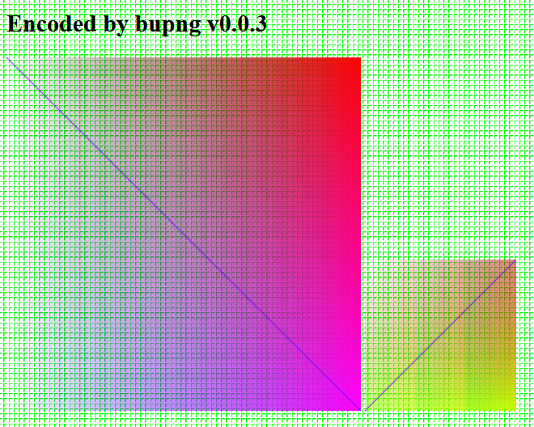
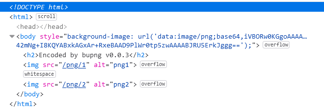

# BuPNG

BuPNG is a javascript library used to create *.png files in [Bun](https://github.com/oven-sh/bun). It is easy to use, zero-dependency, portable, has no legacy nor deprecated code.
The library is heavily based on the [qr-image](https://github.com/alexeyten/qr-image) project (which is unfortunately obsolete for several years), the most understandable implementation of png encoding I could find online. The project [pnglib-es6](https://github.com/IjzerenHein/pnglib-es6) was also helpful by "reverse engineering" of png image data from IDAT chunk.
The [PNG specification](http://www.libpng.org/pub/png/spec/1.2/PNG-Contents.html) describes the file format in details.

There is only one format of png data available, **RGB with alpha channel**, 8 bits per sample (8 * 4 = 32 bits per pixel), the same as *ImageData.data* property of a \<canvas\> element.

## Usage

```javascript
import { BuPNG } from 'bupng';
const bp = new BuPNG(200, 200);

bp.plotPixel(10, 10, 255, 0, 0, 255); //x, y, R, G, B, a
bp.plotLine(10, 10, 100, 20, 255, 0, 0, 255); //x0, y0, x1, y1, R, G, B, a

console.log(bp.getBase64());
//data:image/png;base64,iVBORw0KGgoAAAANSUhEUgAAAMgAAADICAYAAACtWK6eAAAB...
//``

return new Response(bp.getFile());
//content-type: image/png

bp.version;
//bupng v0.0.3
```

## Example

Run
```
bun run start
```
and open `http://localhost:3055` in your browser.




See [start.ts](src/start.ts).

## Benchmark

BuPNG renders about 80 png files with size of 1000x1000 px and compression level 4 or 5 in one second on one 2600 MHz virtual CPU core. See [bench.ts](src/bench.ts).
```
bun run benchmark
```
